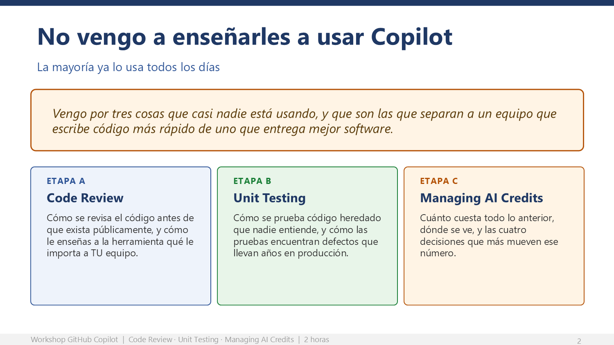

# Apertura: poner a los cincuenta en la misma línea de salida



Doce minutos. El objetivo de este bloque no es enseñar nada: es que los 50 estén
ejecutando el mismo comando, en el mismo repositorio, antes del minuto 12.

## Objetivo de la apertura

Que la sala entienda en tres minutos que esta es una sesión de manos en el teclado,
y que los 50 confirmen que su entorno funciona antes de que empiece la primera etapa.

## Por qué importa

La gente decide en los primeros tres minutos si va a abrir el laptop o a revisar
correo. Si abres con una presentación larga de funcionalidades, los pierdes. Si abres
con "ustedes ejecutan", se enderezan.

---

## Minutos 0 a 5 — Encuadre

Proyecta la diapositiva de encuadre.

**Lo que dices:**

> Hoy no vengo a enseñarles a usar Copilot. La mayoría ya lo usa todos los días.
>
> Vengo por tres cosas que casi nadie está usando y que son justamente las que separan
> a un equipo que escribe código más rápido de un equipo que entrega mejor software:
> cómo se revisa, cómo se prueba, y cuánto cuesta.
>
> En dos horas cada uno de ustedes va a tener, en su propio repositorio: un pull request
> revisado, pruebas donde no había ninguna, al menos un defecto real encontrado en código
> viejo, y la capacidad de explicarle a su jefe con números por qué una tarea de IA cuesta
> lo que cuesta.
>
> Ustedes ejecutan. Yo marco el ritmo y resuelvo lo que se atore.

> **Mensaje clave.** Establece desde el minuto uno que esta es una sesión de manos en
> el teclado, no una demostración.

### Las tres reglas, dichas en voz alta

1. **Copien los prompts, no los inventen.** Somos cincuenta; si todos partimos del mismo
   texto, las diferencias nos enseñan algo. Si cada quien improvisa, solo tenemos ruido.
2. **Lean antes de aceptar.** Nada entra al código sin pasar por su criterio.
3. **Si se atoran, sigan la ruta Base y levanten la mano.** Los ejercicios Extra son
   opcionales a propósito.

---

## Minutos 5 a 12 — Verificación de entorno

Proyecta la diapositiva de arranque y pide que corran, en este orden y sin explicaciones
largas:

```bash
npm run verifica
npm test
```

`npm run verifica` revisa versión de Node, git, dependencias, ubicación fuera de carpetas
sincronizadas y **que la aplicación cargue sin errores**. Termina con "Entorno listo".

`npm test` debe responder **"No tests found"**. Ese cero es el punto de partida de la
etapa B; pídeles que lo anoten.

Pregunta en voz alta: **"¿a quién le falló algo?"**. Cuenta las manos.

- **Menos de cinco manos:** resuélvelos por el canal mientras avanzas con el resto.
- **Más de cinco manos:** dedica tres minutos más, no más.

> **Riesgo — npm bloqueado por política de PowerShell.**
> Es el problema **más probable** de esta sesión y pega justo en el primer comando.
> En equipos donde PowerShell no ejecuta scripts sin firma, `npm` falla con
> *"npm.ps1 no está firmado digitalmente"* / `UnauthorizedAccess`.
>
> **Solución en una línea:** que escriban **`npm.cmd`** en lugar de `npm`
> (`npm.cmd install`, `npm.cmd test`, `npm.cmd run verifica`). No requiere cambiar
> ninguna política ni permisos de administrador.
>
> Tenlo escrito en el canal **antes** de empezar. Si ves más de tres manos por esto,
> dilo a toda la sala de una vez en lugar de atender uno por uno.

> **Riesgo — "destination path already exists".**
> Le pasa a quien ya había clonado antes. No hay que volver a clonar: que entren con
> `cd C:/dev/ghcp-workshop-calidad` y sigan desde `npm install`. Si quieren empezar
> limpio, `Remove-Item C:/dev/ghcp-workshop-calidad -Recurse -Force`.

> **Riesgo — alguien intentó hacer fork.**
> Si alguien pregunta por el fork: **no aplica**. Sus cuentas corporativas gestionadas
> no pueden forkear repositorios externos. Es normal que les haya fallado y no afecta
> nada: el flujo de hoy es clonar directo. Dilo sin dramatismo y sigue.

> **Riesgo — el impulso de arreglar todo.**
> Vas a sentir la tentación de resolver los cinco problemas de entorno antes de empezar.
> No lo hagas: gastas veinte minutos del grupo para atender al diez por ciento. Empareja
> a los que fallaron con un vecino y arranca. La sala completa esperando a una máquina es
> la forma más rápida de perder la sesión.

> **Riesgo — licencias.**
> Si alguien llega sin licencia activa, no hay ejercicio que lo salve. Ponlo a trabajar
> en pareja: que el que no tiene licencia haga el triaje y la lectura crítica, y el que
> sí tiene, ejecute. Es incluso una buena dinámica. Lo que no debes hacer es detener la
> sala intentando resolver una asignación de licencia en vivo.

---

## Antes de la sesión

### T menos 5 días

1. Envía el documento de prerrequisitos a los cincuenta. Uno solo, corto, sin adjuntos pesados.
2. Confirma con el administrador de GitHub que los cincuenta tienen licencia asignada y
   activa. **Este es el punto de falla número uno** y el único que no se resuelve en vivo.
3. Pide que cada quien haga fork del repositorio y corra `npm run verifica`.
4. Abre un canal de Teams o Slack para la sesión.

### T menos 1 día

1. Pide confirmación por el canal de quién corrió `npm run verifica` sin fallas. Persigue
   a los que no contesten.
2. Corre tú mismo la sesión completa de principio a fin en una máquina limpia. Sí, completa:
   los prompts cambian de comportamiento con las versiones.
3. Ten listo tu **pull request de demostración** para el ejercicio A.5, y un segundo con la
   revisión ya completada como plan B. Está detallado en la etapa A.

### T menos 30 minutos

1. Abre VS Code con el repositorio limpio, el chat de Copilot visible y el tamaño de fuente
   subido para proyección (`Ctrl+Shift+P` → Zoom In, al menos tres veces).
2. Abre en pestañas separadas: tu pull request de demostración, la tabla de precios por
   modelo, y la página de consumo de tu cuenta.
3. Ten esta guía en una segunda pantalla o impresa. **No la proyectes.**
4. Pega en el canal el enlace del repositorio, el de `PROMPTS.md` y **el tip de `npm.cmd`**:

   > Si `npm` te da error de *"no está firmado digitalmente"*, escribe `npm.cmd` en
   > lugar de `npm`. Por ejemplo: `npm.cmd install`.

   Déjalo fijado. Te va a ahorrar atender el mismo problema cinco veces por separado.

---

## ¿Qué hemos hecho hasta aquí?

- Los 50 están en el mismo repositorio, con el mismo código y la misma cobertura en cero.
- Todos saben que ellos ejecutan.
- Sabes quién tiene problemas de entorno y ya los emparejaste.

## Bitácora

Regresa a la [Bitácora del presentador](bitacora-del-presentador.md) y marca:

- [x] 0. La sala arrancó a tiempo
