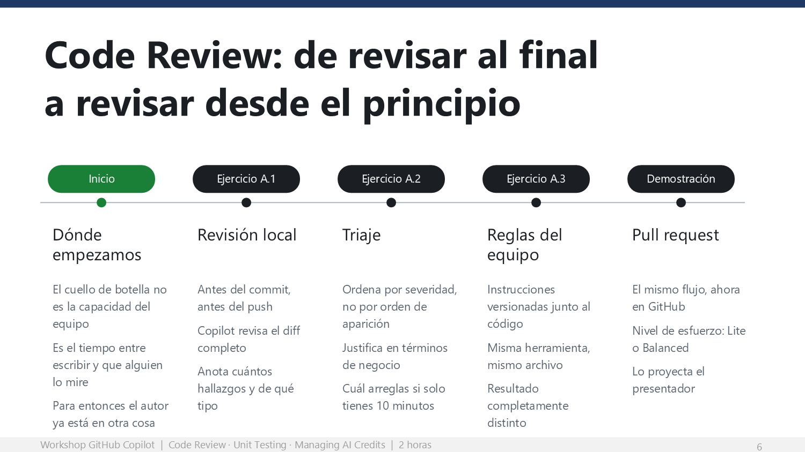

# Code Review: de revisar al final a revisar desde el principio



Cuarenta y tres minutos (12–55). El objetivo no es que Copilot revise por ellos: es que
**ellos revisen mejor y más rápido** con Copilot como primera pasada.

## Objetivo de la etapa

Que cada participante ejecute una revisión de código asistida en dos momentos distintos
del flujo — local antes del commit, y en el pull request — y compruebe con sus propios
ojos que el resultado cambia por completo cuando el repositorio le dice a la herramienta
qué le importa al equipo.

## Conceptos que explicas con la diapositiva

Proyecta la apertura de etapa **antes** de que corran nada, y recorre la línea de tiempo:

| Concepto | Qué tienen que entender |
|---|---|
| **Revisión local** | Copilot puede revisar un diff sin confirmar. Ocurre antes del commit, antes del push, antes de ocupar el tiempo de un compañero. |
| **Severidad y triaje** | Una lista de veinte comentarios sin jerarquía no es una revisión: es ruido. Ordenar es la habilidad, no encontrar. |
| **Instrucciones personalizadas** | Un archivo de texto plano versionado junto al código cambia lo que la herramienta considera importante. Se escribe una vez. |
| **Revisión en el pull request** | Es el registro auditable que el proceso de calidad necesita. No compite con la revisión local: cubre otro momento. |
| **Nivel de esfuerzo** | Lite para lo evidente, Balanced para lógica compleja y código sensible. Es una decisión de costo que toman ellos. |

## Por qué importa

**Lo que dices al abrir:**

> Piensen en la última vez que revisaron un pull request de un compañero. ¿Cuánto
> tardaron en dar la primera vuelta? ¿Y cuánto tardó él en recibirla?
>
> El problema de la revisión de código nunca fue la capacidad técnica del equipo. Fue el
> tiempo entre que alguien escribe algo y alguien más lo mira. A veces días. Y cuando por
> fin llega, el autor ya está en otra cosa.
>
> Vamos a meter una primera pasada antes de ese hueco. No para reemplazar la revisión
> humana: para que cuando llegue, llegue a un código que ya pasó por un filtro. Eso cambia
> la conversación del pull request por completo.

> **Mensaje clave.** La revisión de Copilot no sustituye al revisor humano: le cambia el
> punto de partida. El humano deja de cazar variables sin usar y empieza a discutir diseño.
> Esa es la venta real.

---

## Ejercicio A.0 — Prepara el cambio a revisar

**Minutos 12–18 · Ruta Base · Terminal**

Demuestra tú el comando en pantalla y pídeles que lo corran:

```bash
npm run ejercicio:a
```

El script crea `src/descuentos.js` y engancha una ruta nueva en `src/server.js`. El
resultado son **dos archivos con cambios sin confirmar**.

Abre el panel de Control de código fuente en tu pantalla y muéstrales el diff.

**Lo que dices:**

> Esto es exactamente lo que tendrían justo antes de pedirle revisión a un compañero.
> Todavía no existe públicamente.

> **Nota.** Los cincuenta parten del mismo diff, con los mismos defectos. Cuando comparen
> hallazgos al final del bloque, las diferencias van a venir de cómo pidieron la revisión,
> no de qué código les tocó.

---

## Ejercicio A.1 — Revisión local, antes de confirmar nada

**Minutos 18–28 · Ruta Base · VS Code**

### Pasos

1. Abrir el panel **Control de código fuente** (`Ctrl+Shift+G`).
2. En la barra de título de la sección **Cambios**, hacer clic en el icono de revisión
   de Copilot (las estrellitas).
3. Recorrer los comentarios con `F8` / `Shift+F8`.
4. **Anotar cuántos hallazgos obtuvieron y de qué tipo.**

Muestra el botón en tu pantalla. Es pequeño y la mitad de la sala no lo va a encontrar
sola: proyéctalo grande y señálalo.

> **La instrucción que no puedes olvidar.**
> Diles que **ANOTEN** cuántos hallazgos obtuvieron y de qué tipo. Sin ese dato, el
> ejercicio A.3 pierde todo su impacto, porque no van a tener contra qué comparar.
> Repítelo dos veces.

### Qué deberían ver

Entre seis y doce comentarios: una credencial escrita en el código, una consulta
construida por concatenación de cadenas, un `JSON.parse` sin protección, bucles anidados
sobre la misma colección, y varias observaciones de estilo sobre `var` y `==`.

> **Riesgo — el botón no aparece.**
> En versiones anteriores de VS Code, el icono de revisión no está en
> Control de código fuente. La alternativa está en su guía: seleccionar todo el archivo
> con `Ctrl+A`, clic derecho, menú Copilot, **Review and Comment**. Ten esa ruta lista
> para proyectarla; en un grupo de cincuenta siempre hay tres o cuatro versiones distintas.

---

## Ejercicio A.2 — Triaje: no todos los hallazgos valen lo mismo

**Minutos 28–36 · Ruta Base · VS Code, modo Ask**

Mientras corren el prompt, camina por la sala. Al minuto 33, pide a dos o tres personas
que lean en voz alta cuál pusieron como hallazgo número uno.

**Lo que dices:**

> Fíjense en lo que acaba de pasar. Todos recibimos más o menos los mismos comentarios,
> pero el orden importa más que la lista.
>
> Una revisión de veinte comentarios sin jerarquía no es una revisión: es ruido. Y el
> ruido es lo que hace que la gente deje de leer las revisiones.
>
> La habilidad que estamos practicando no es encontrar problemas. Es ordenarlos.

> **Mensaje clave.** Encontrar problemas es barato. Priorizarlos es lo caro, y es lo que
> sigue siendo trabajo humano aun con la mejor herramienta.

### Puntos a discutir

- ¿Coincidieron todos en cuál es el hallazgo de severidad más alta?
- ¿Alguno de los hallazgos "de estilo" tiene impacto de negocio que no sea obvio?
- ¿Qué harían si el pull request es urgente y solo pueden arreglar uno?

---

## Ejercicio A.3 — La misma revisión, con las reglas del equipo

**Minutos 36–45 · Ruta Base · VS Code**

**Este es el ejercicio más importante de toda la etapa. No lo apures y no lo cortes.**

### Pasos

1. Copiar `ejercicios/bloque-a/revision.instructions.md` a `.github/instructions/`.
2. **Abrir el archivo y leerlo.** Son las reglas de revisión de un equipo, escritas una
   sola vez: severidad por tipo de defecto, prioridad al dinero y a la seguridad, y una
   instrucción explícita de no comentar sobre formato.
3. Repetir la revisión del ejercicio A.1 sobre el mismo archivo.
4. Comparar con lo anotado en A.1.

**Lo que dices:**

> Van a copiar un archivo de treinta líneas. Ábranlo y léanlo antes de correr nada.
>
> Ahora pidan la misma revisión, sobre el mismo archivo, con la misma herramienta.
>
> Comparen con lo que anotaron hace veinte minutos. Misma herramienta, mismo código,
> resultado distinto. La diferencia son treinta líneas de texto plano versionadas junto
> al código.
>
> Cuando alguien les diga que la revisión automática es genérica, la respuesta es que
> nadie le dijo qué no es genérico en ese repositorio.

> **Mensaje clave.** Las instrucciones personalizadas son el multiplicador de todo lo
> demás. Es el único artefacto de la sesión que sigue trabajando cuando la sesión termina,
> y el que van a poder llevarse a su repositorio real el lunes.

> **Riesgo — el comando de copia.**
> Algunos van a estar en PowerShell, otros en Git Bash, otros en macOS. La guía del
> participante trae las dos variantes. Si alguien se atora, la ruta infalible es crear la
> carpeta y arrastrar el archivo desde el explorador de VS Code. No pierdas tres minutos
> depurando sintaxis de terminal.

---

## Ejercicio A.4 — El complemento en la web: el pull request

**Minutos 45–55 · Ruta Base · Terminal y github.com**

Aquí la sesión cruza de VS Code a la web. Dilo explícitamente: **no son dos productos,
son dos momentos del mismo flujo.**

### Pasos

1. Crear rama, confirmar y subir (los comandos están en `PROMPTS.md`).
2. **Verificar la base del pull request:** debe ir de `bloque-a/promociones` a `main`
   de **su propio fork**.
3. Elegir el nivel de esfuerzo y pedir la revisión a Copilot.
4. Leer los comentarios y comparar la etiqueta de severidad con el triaje de A.2.
5. Aplicar **Commit suggestion** en un comentario con sugerencia.
6. Probar **Fix with Copilot** en un comentario más complejo.

> **El error que va a cometer media sala.**
> GitHub propone por defecto abrir el pull request contra el repositorio original, no
> contra su fork. Diles **antes** de que lo creen que verifiquen la base. Si alguien lo
> abre contra el upstream, que lo cierre y lo vuelva a abrir. Pero avísalo antes, no después.

Mientras esperan la revisión, explica el nivel de esfuerzo:

> Antes de pedir la revisión pueden elegir el nivel de esfuerzo.
>
> **Lite** va por lo evidente: errores claros, vulnerabilidades, estilo. Es rápido y barato.
>
> **Balanced** analiza lógica compleja, código sensible a seguridad y cambios que cruzan
> servicios, con un modelo de mayor razonamiento.
>
> Elegir siempre Balanced para un cambio de dos líneas es tirar dinero. Elegir Lite para
> el módulo de pagos es ahorrar en el lugar equivocado. Esa decisión es suya, y en la
> etapa C van a entender exactamente cuánto pesa.

> **Mensaje clave.** Aquí plantas la semilla de la etapa C. Cuando lleguen a los créditos,
> ya van a tener una decisión de costo que tomaron con las manos, no una teoría.

> **Riesgo — la revisión del pull request tarda o no arranca.**
> En forks recién creados, las acciones pueden tardar en habilitarse. Si a los dos minutos
> no hay comentarios, que pidan un re-review con el botón circular junto al nombre de
> Copilot. Si aun así nada, **no detengas la etapa**: lo importante ya ocurrió en el IDE.
> Proyecta tu propio pull request resuelto y sigue.

### Ruta Extra — A.5

Si vas bien de tiempo: que respondan a un comentario de Copilot con su propio criterio y
lo cierren con **Resolve conversation**. Los comentarios de Copilot se comportan como los
de un humano: se pueden discutir, ignorar y cerrar. Esto quita la ansiedad de "y si me
equivoco al aceptar".

---

## ¿Qué hemos hecho hasta aquí?

**Lo que dices al cerrar:**

> Revisaron el mismo código dos veces. La primera con los criterios de fábrica. La segunda
> con los criterios de su equipo. Y vieron que el resultado cambia.
>
> Guarden los hallazgos. Porque los defectos que la revisión les señaló son, casualmente,
> los que vamos a convertir en pruebas ahora mismo.

Al terminar esta etapa, cada participante:

- **Revisó un cambio antes de confirmarlo**, no después de que le costara tiempo a alguien más.
- **Priorizó hallazgos** por impacto de negocio en lugar de por orden de aparición.
- **Enseñó al repositorio** qué considera importante su equipo, con un archivo versionado.
- **Llevó el cambio al pull request**, que es donde queda el registro auditable.

## Regla de tiempo

> **Al minuto 55 tienes que estar cerrando esta etapa, pase lo que pase.** Si vas
> retrasado, el sacrificio es A.5 y la discusión del pull request, **nunca la etapa B**.
> La etapa B es la que deja el argumento de negocio. Perder el final por alargar el
> principio es el error más caro de esta sesión.

## Bitácora

Regresa a la [Bitácora del presentador](bitacora-del-presentador.md) y marca:

- [x] 1. Revisaron antes de confirmar
- [x] 2. Vieron la diferencia con instrucciones del equipo
- [x] 3. Llegaron al pull request
