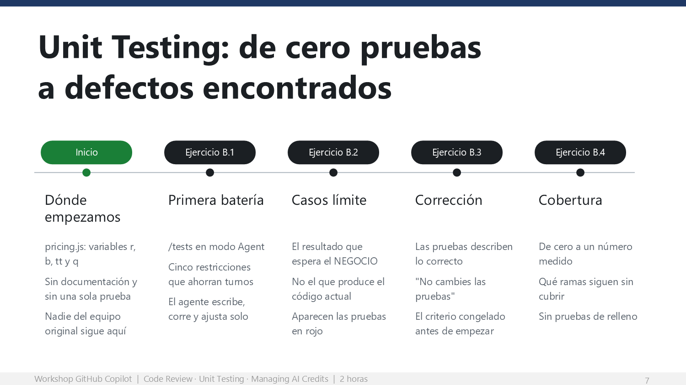

# Unit Testing: de cero pruebas a defectos encontrados



Cuarenta minutos (55–95). Cambia el foco: de código que acaban de escribir a código que
nadie ha tocado en años y que nadie entiende.

## Objetivo de la etapa

Que cada participante lleve `src/pricing.js` de cero pruebas a una suite con cobertura
medida, y que en el camino **las pruebas revelen defectos reales** que llevaban años en
producción — no porque el modelo sea listo, sino por cómo ellos escribieron el criterio.

## Conceptos que explicas con la diapositiva

| Concepto | Qué tienen que entender |
|---|---|
| **Línea base** | Medir antes de empezar. `npm test` responde "No tests found". Ese cero es el argumento. |
| **Restricciones en el prompt** | Cada restricción ahorra un turno completo de conversación. No son formalismos: son dinero y tiempo. |
| **Criterio de negocio vs. comportamiento actual** | La diferencia entre una prueba que **encuentra** un defecto y una que lo **documenta**. Es el concepto central de la etapa. |
| **Congelar el criterio** | "No cambies las pruebas" invierte la relación: el agente trabaja contra un contrato, no contra el semáforo verde. |
| **Cobertura dirigida** | La cobertura es termómetro, no meta. Treinta pruebas redundantes dan 95 % y cero confianza. |

## Por qué importa

**Lo que dices al abrir:**

> Abran `src/pricing.js`. Denle treinta segundos de lectura honesta. No intenten
> entenderlo todo.
>
> Las variables se llaman `r`, `b`, `tt` y `q`. No hay documentación. No hay una sola
> prueba. Nadie del equipo original sigue en la empresa.
>
> Y está en producción, calculando el precio de cada cotización.
>
> Levanten la mano los que tienen un archivo así en su repositorio real.

La mayoría va a levantar la mano. **Ese momento compra su atención para los siguientes
cuarenta minutos.**

---

## Ejercicio B.0 — La línea base

**Minutos 55–58 · Ruta Base · Terminal**

```bash
npm test
```

La respuesta es **"No tests found"**. Pídeles que anoten ese cero.

> **Mensaje clave.** Medir antes de empezar es la mitad del argumento. Lo que convence a
> un líder no es "Copilot escribe pruebas", es "pasamos de 0 % a más de 90 % de cobertura
> en cuarenta minutos y encontramos defectos reales".

---

## Ejercicio B.1 — La primera batería de pruebas

**Minutos 58–68 · Ruta Base · VS Code, modo Agent**

El prompt usa `/tests` y trae **cinco restricciones**. Mientras corre el agente, explica
por qué:

**Lo que dices:**

> Fíjense en la línea que dice "no modifiques `src/pricing.js` todavía".
>
> Sin esa línea, lo más fácil para cualquier agente cuando una prueba falla es ajustar el
> código para que pase. Y ahí es donde se pierde todo: terminas con una suite verde que
> protege un defecto.
>
> Cada restricción del prompt ahorra un turno completo de conversación. No son formalismos:
> son dinero y tiempo.

### Qué deberían ver

El agente lee el archivo, deduce el contrato de cada función, escribe `tests/pricing.test.js`,
corre `npm test` y muestra el resultado. Si algo falla, lo lee y ajusta solo. Todo en un
turno.

> **Riesgo — el agente pide permisos de terminal.**
> La primera vez que el agente quiera ejecutar `npm test`, VS Code va a pedir confirmación.
> Avísalo **antes** de que pase o vas a tener treinta manos levantadas al mismo tiempo.
> Diles que acepten y, si su versión lo ofrece, que marquen recordar para esta sesión.

---

## Ejercicio B.2 — Donde de verdad duele: los casos límite

**Minutos 68–80 · Ruta Base · VS Code, modo Agent**

> **Este es el momento cumbre de la sesión.**
> Cuando aparezcan las pruebas en rojo, **para la sala**. No dejes que pasen de largo
> pensando que se equivocaron. Diles explícitamente: esas pruebas no están mal escritas,
> están revelando defectos que llevan años en producción.

### El resultado que debes ver

Con los seis casos del prompt, el resultado típico es **3 pruebas en rojo y 3 en verde**:

| Caso | Qué hace el código hoy | Qué esperaría el negocio |
|---|---|---|
| Descuento de monto fijo mayor que el subtotal | Devuelve **un total negativo** | Topar en cero |
| Dos descuentos porcentuales de 60 % | Se **componen** uno sobre otro y dejan al cliente pagando el 16 % | Sumar y topar en 100 % |
| País sin tasa registrada | Aplica **cero impuesto, en silencio** | Lanzar un error explícito |

Los otros tres casos (descuentos vacíos, porcentual de 100, partidas vacías) pasan.

> Si en la sala alguien reporta las seis en verde, casi siempre significa que el agente
> escribió las expectativas contra el comportamiento actual del código en lugar de contra
> el comportamiento esperado por el negocio. Pídele que vuelva a correr el prompt completo:
> la frase clave se perdió.

**Lo que dices:**

> Un descuento de monto fijo mayor que el subtotal deja el total en negativo. El sistema
> le está pagando al cliente por comprar.
>
> Un país que no está en la tabla de impuestos se trata como si no pagara impuestos. Cero.
> Silenciosamente.
>
> Y el tercero es más sutil: dos descuentos del sesenta por ciento no dan ciento veinte
> topado en cien. Se componen uno sobre otro y dejan al cliente pagando el dieciséis por
> ciento. Ni el negocio ni el cliente esperan eso.
>
> Ninguno de los tres es un error de la prueba. Son defectos reales que llevan años ahí,
> y nadie los había visto porque no había una sola prueba que preguntara.
>
> Y fíjense qué fue lo que los encontró: no fue el modelo. Fue la frase que ustedes
> escribieron: "el resultado que el negocio esperaría, no el que el código produce".

> **Mensaje clave.** Este es el hallazgo que la gente cuenta al día siguiente en su equipo.
> Si solo tienes tiempo para una cosa de la etapa B, es esta. Dedícale los minutos que haga
> falta aunque sacrifiques B.4.

### Puntos a discutir

- ¿Cuál de los tres defectos habría llegado más lejos sin ser detectado?
- El del descuento compuesto no es claramente un bug: es una **ambigüedad de negocio**.
  ¿Quién debería decidirlo, y por qué no está documentado en ninguna parte?
- ¿Cuántos módulos así tienen en su repositorio real?

---

## Ejercicio B.3 — Del defecto a la corrección

**Minutos 80–88 · Ruta Base · VS Code, modo Agent**

Recalca la frase **"no cambies las pruebas"**. Es la que sostiene el ejercicio completo.

**Lo que dices:**

> Acaban de invertir la relación. Normalmente ustedes le piden al agente que arregle algo
> y después revisan si lo hizo bien.
>
> Aquí definieron el criterio de éxito primero, lo congelaron, y el agente trabajó contra
> ese criterio. Eso es exactamente lo que hace un contrato.
>
> Cuando le das un criterio objetivo, el agente trabaja para ustedes. Cuando no se lo das,
> trabaja para el semáforo verde.

### Qué deberían ver

Todo en verde, con `src/pricing.js` corregido en tres puntos: tope en cero, acumulación
de porcentajes con tope en 100 %, y error explícito para país sin tasa.

---

## Ejercicio B.4 — Cobertura: de cero a número real

**Minutos 88–95 · Ruta Base · VS Code, modo Ask**

```bash
npm run test:cov
```

**Etapa comprimible.** Si vas retrasado, esta es la primera que recortas: pide que corran
el comando, proyecta tu número y sigue.

Con las seis pruebas de B.2 y B.3, `pricing.js` queda alrededor de **71 % de sentencias y
91 % de líneas**. El prompt les pide cerrar solo las ramas que faltan.

> **Mensaje clave.** La cobertura no es la meta, es el termómetro. Una suite de treinta
> pruebas redundantes da 95 % y cero confianza. Por eso el prompt dice explícitamente
> "no inventes pruebas de relleno".

### Ruta Extra — B.5

Pruebas de la API con `supertest` sobre `src/server.js`. Lo interesante del prompt es la
última línea: "no levantes el servidor con `app.listen`". Es conocimiento del dominio que
el agente no puede adivinar y que, si no se lo dan, produce pruebas que se quedan colgadas.

---

## ¿Qué hemos hecho hasta aquí?

Al terminar esta etapa, cada participante:

- **Midió la línea base** y tiene el antes y el después en números.
- **Generó pruebas con criterio de negocio**, no contra el comportamiento actual del código.
- **Encontró defectos reales** en código heredado que llevaba años en producción.
- **Corrigió el código contra un criterio congelado**, sin dejar que el agente moviera la meta.
- **Midió la cobertura** y cerró solo las ramas que faltaban.

> Ese dato — cuántos defectos encontraron y en cuánto tiempo — es el caso de negocio que
> van a necesitar cuando propongan esto en su equipo. Diles que lo anoten.

## Bitácora

Regresa a la [Bitácora del presentador](bitacora-del-presentador.md) y marca:

- [x] 4. Anotaron la línea base en cero
- [x] 5. Vieron pruebas en rojo en B.2
- [x] 6. Cerraron con cobertura medida
