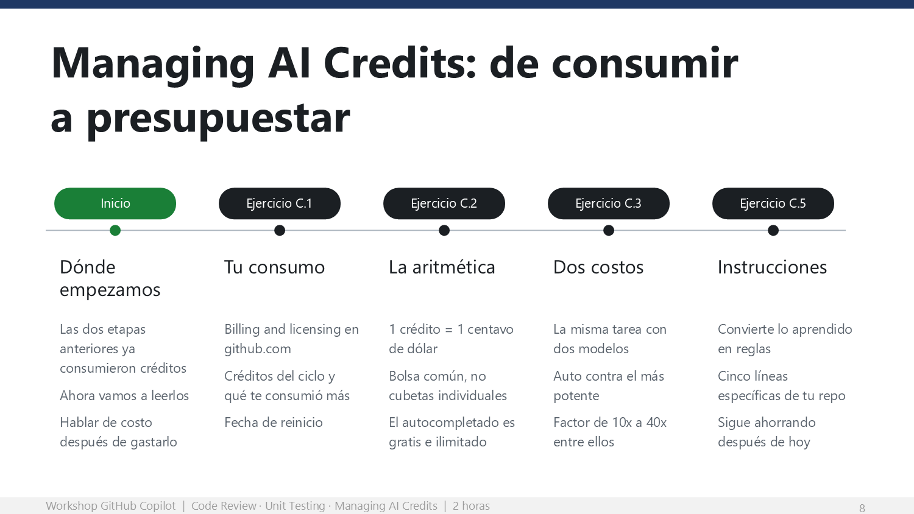
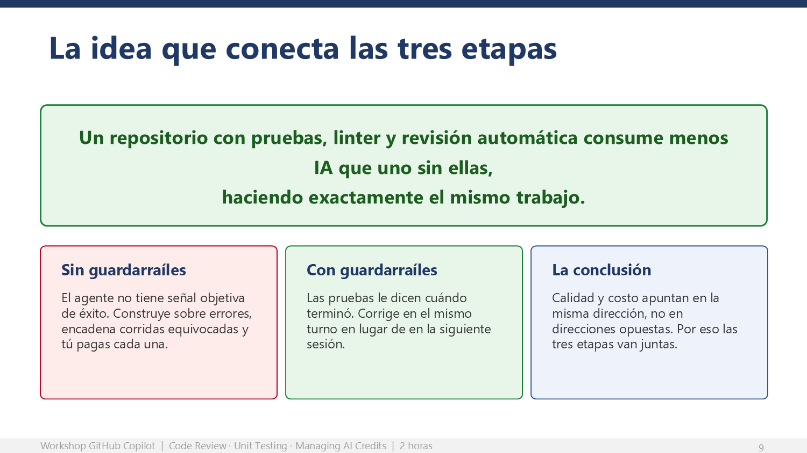

# Managing AI Credits: de consumir a presupuestar

Veinte minutos (95–115). Las dos etapas anteriores consumieron créditos reales de la
organización. Esta etapa enseña a leer ese consumo y, sobre todo, a bajarlo sin perder
capacidad.

## Objetivo de la etapa

Que cada participante encuentre su propio consumo en github.com, entienda la aritmética
que lo produce, y ejecute al menos una decisión de modelo con las manos para comprobar
que la misma tarea puede costar órdenes de magnitud distintos.

## Conceptos que explicas con la diapositiva

| Concepto | Qué tienen que entender |
|---|---|
| **AI credit** | 1 crédito = 0.01 USD. Es la unidad de cobro; todo se convierte a esto. |
| **Bolsa común** | Business incluye 1,900 por usuario al mes; Enterprise, 3,900. Se juntan a nivel organización, no en cubetas individuales. |
| **Qué no consume** | El autocompletado y las next edit suggestions son **ilimitados** y no consumen créditos. |
| **Qué sí consume** | Chat, modo agente, CLI, cloud agent, Spaces y la revisión de código. Lo que invoca un modelo a petición suya. |
| **Costo de una interacción** | Modelo elegido × tokens consumidos (entrada, salida y caché). Por eso dos prompts iguales pueden costar muy distinto. |
| **Caché** | Los tokens en caché cuestan cerca del 10 % de los de entrada. Se invalida al cambiar de modelo o configuración a media sesión. |

## Por qué esta etapa va al final

Porque ahora tienen consumo propio que mirar. Hablar de créditos antes de gastarlos es
una clase de economía; hablar de créditos después de gastarlos es una revisión de su
propio trabajo.

> **Advertencia sobre el tono.**
> Esta etapa se puede leer como "úsenlo menos". **No es eso, y hay que decirlo
> explícitamente.** El mensaje correcto es **"úsenlo mejor"**. Si la sala sale creyendo
> que la organización quiere que usen menos Copilot, perdiste la sesión completa en los
> últimos veinte minutos.

---

## Ejercicio C.1 — Tu consumo real

**Minutos 95–98 · Ruta Base · github.com**

**Lo que dices:**

> Entren a su configuración de GitHub, a la sección de facturación, y busquen su consumo
> de IA.
>
> Lo que acaban de hacer en las últimas dos horas ya está ahí.
>
> Tres números: cuánto llevan este mes, qué funcionalidad les consumió más, y cuándo se
> reinicia el ciclo.

Ruta: foto de perfil → **Settings** → **Billing and licensing** → vista de consumo de IA.

---

## Ejercicio C.2 — La aritmética

**Minutos 98–100 · Ruta Base**

Los hechos que debes decir en voz alta, **en este orden**:

| Hecho | Por qué lo dices así |
|---|---|
| Un crédito es un centavo de dólar | Vuelve tangible una unidad abstracta |
| Business incluye 1,900 al mes por persona; Enterprise, 3,900 | Son 19 y 39 dólares. Compáralo con el costo de una hora de su tiempo |
| Se juntan en una bolsa común de toda la organización | Quita la ansiedad individual. Nadie está mirando su número personal con lupa |
| El autocompletado no consume nada y es ilimitado | Es el dato que más alivia a la sala. **Dilo fuerte** |
| Lo que consume es chat, agente, CLI y revisión de código | Marca la frontera con precisión |
| El costo es el modelo por los tokens | Prepara la palanca número uno del siguiente ejercicio |

> **Mensaje clave.** El autocompletado ilimitado es el dato que más tranquiliza y el que
> más se olvida. La mayor parte de la productividad diaria de un desarrollador con Copilot
> **no cuesta créditos**.

### Ejercicio de comparación

Que abran la [tabla oficial de precios por modelo](https://docs.github.com/en/copilot/reference/copilot-billing/models-and-pricing),
busquen un modelo ligero y uno frontier, y comparen el precio de salida por millón de
tokens. El factor está normalmente **entre 10x y 40x**.

---

## Ejercicio C.3 — La misma tarea, dos costos

**Minutos 100–108 · Ruta Base · VS Code**

El ejercicio es sencillo: documentar tres funciones con **Auto**, deshacer el cambio, y
repetir con el modelo más potente disponible.

**Lo que dices:**

> Misma tarea. Mismo resultado útil. Costo muy distinto.
>
> Documentar, formatear, renombrar y refactorizar son tareas donde el modelo caro no les
> da nada extra. Y les voy a decir algo peor: en tareas de pura ejecución, los modelos de
> razonamiento a veces **empeoran** el resultado, porque sobre-piensan el problema e
> introducen cambios que nadie pidió.
>
> La regla práctica es de tres líneas. Razonamiento para arquitectura, depuración compleja
> y planeación. Intermedio cuando el plan ya está claro. Ligero para refactor, formato y
> documentación.
>
> Y por default: **Auto**. Además de elegir por ustedes, trae diez por ciento de descuento
> sobre el costo del modelo.

> **Mensaje clave.** La decisión que más mueve el consumo no es cuántas veces usan Copilot:
> es **con qué modelo**.

---

## Ejercicio C.4 — Las cuatro palancas

**Minutos 108–112 · Esta parte la hablas tú**

Proyecta la tabla de la guía del participante. Un minuto por palanca.

| Palanca | La frase con la que la cierras |
|---|---|
| **Modelo correcto** | "Usen tanta capacidad como la tarea requiera, y tan poca como sea posible." |
| **Contexto delgado** | "Cuando cambien de problema, abran un chat nuevo. Una conversación larga arrastra todo su pasado en cada mensaje." |
| **Respetar el caché** | "Configuren antes de empezar y no lo muevan. Cambiar de modelo a media sesión tira el caché, y el caché cuesta la décima parte." |
| **Guardarraíles deterministas** | "Esto es la etapa B. Las pruebas no son solo calidad: son lo que le dice al agente cuándo terminó." |

> **El remate de toda la sesión.**
> La cuarta palanca es donde las tres etapas se cierran en una. Un repositorio con pruebas,
> linter y revisión automática **consume menos IA** que uno sin ellas, haciendo exactamente
> el mismo trabajo, porque el agente deja de construir sobre errores. Calidad y costo
> apuntan en la misma dirección. Si la sala se lleva una sola frase de las dos horas, que
> sea esta.

### Puntos a discutir

- ¿Cuál de las cuatro palancas pueden aplicar mañana sin pedirle permiso a nadie?
- ¿Cuántas de sus conversaciones de chat de la semana pasada debieron haber sido chats nuevos?
- Si su repositorio no tiene pruebas, ¿cuánto creen que están pagando de más en reintentos?

---

## Ejercicio C.5 — Convierte lo aprendido en instrucciones

**Minutos 112–115 · Ruta Base · VS Code, modo Ask**

Tres minutos. Que generen cinco reglas para `.github/copilot-instructions.md`, **borren lo
genérico** y confirmen con git.

Lo importante no es el archivo: es que se vayan con la costumbre.

> **Mensaje clave.** Es el único artefacto de hoy que sigue trabajando para ellos cuando
> la sesión termina. Dilo con esas palabras.

---

## ¿Qué hemos hecho hasta aquí?

Al terminar esta etapa, cada participante:

- **Encontró su consumo real** en github.com y sabe cuándo se reinicia el ciclo.
- **Entiende la aritmética**: modelo × tokens, bolsa común, y qué es gratis.
- **Ejecutó una decisión de modelo** y vio la diferencia con sus propias manos.
- **Conoce las cuatro palancas** y por qué la cuarta conecta con las etapas A y B.
- **Escribió instrucciones propias** que aplican esas decisiones automáticamente.

## Bitácora

Regresa a la [Bitácora del presentador](bitacora-del-presentador.md) y marca:

- [x] 7. Encontraron su consumo
- [x] 8. Compararon dos modelos con las manos
- [x] 9. Se llevaron el remate: calidad y costo van juntos
