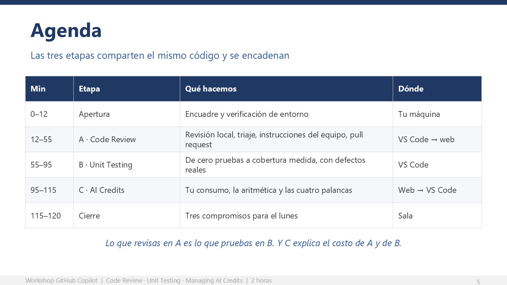

# Cierre: qué hacen el lunes

Cinco minutos (115–120). No los sacrifiques. Una sesión práctica sin cierre se evapora
en 48 horas.

## Objetivo del cierre

Que cada participante salga con **tres acciones concretas** que puede ejecutar en su
repositorio real esta misma semana, y con la frase que conecta las tres etapas.

---

## Lo que dices

> Hace dos horas tenían un repositorio con cero pruebas y un cambio sin revisar.
>
> Ahora tienen: un pull request revisado con hallazgos priorizados, una suite de pruebas
> con cobertura medida, al menos un defecto real que llevaba años en producción, y un
> archivo de instrucciones escrito por ustedes.
>
> Nada de eso lo hizo Copilot solo. Todo lo decidieron ustedes. Copilot hizo la parte
> mecánica, que es la que nunca les gustó de todas formas.
>
> Tres cosas para el lunes.

## Los tres compromisos

1. **Creen o mejoren el archivo `.github/copilot-instructions.md`** de su repositorio
   principal, con las convenciones reales de su equipo. Es lo que más ahorro genera por
   minuto invertido.
2. **Pidan revisión de Copilot en su próximo pull request real**, antes de asignárselo a
   un compañero. Comparen la conversación que resulta con la del pull request anterior.
3. **Elijan el módulo sin pruebas que más miedo les da tocar** y aplíquenle la secuencia
   B.1 a B.4. Anoten cuántos defectos encontraron: **ese número es su caso de negocio.**

---

## Señales de que la sesión funcionó

| Señal | Qué observar |
|---|---|
| Alguien dice "esto lo tengo igualito en mi repo" | La transferencia al trabajo real ya ocurrió mentalmente. La mejor señal de todas. |
| Alguien discute con un hallazgo de Copilot | Dejaron de tratarlo como oráculo. Es exactamente el criterio que veníamos a construir. |
| Preguntan cómo llevar las instrucciones a su monorepo | Están pensando en adopción, no en la demostración. |
| Al menos la mitad llegó al pull request con revisión | Umbral de éxito operativo de la etapa A. |
| Casi todos vieron pruebas en rojo en B.2 | Umbral de éxito de la etapa B. Si no pasó, el prompt se copió mal. |
| Nadie pregunta si los van a medir por consumo | La etapa C se comunicó con el tono correcto. |

---

## Preguntas difíciles y cómo responderlas

**"¿Entonces ya no necesitamos revisores humanos?"**
Al contrario: los necesitas para lo que solo ellos pueden hacer. Copilot atrapa lo mecánico
y lo repetitivo. El humano discute diseño, contexto de negocio y consecuencias. Lo que se
elimina es la parte de la revisión que a nadie le gustaba hacer.

**"¿Las pruebas generadas por IA sirven de algo?"**
Sirven exactamente lo que valga el criterio con el que las pediste. Lo vimos hoy: el mismo
agente, con la frase "el resultado que el negocio esperaría", encontró tres defectos reales;
sin esa frase, habría escrito pruebas que documentan el error. La IA no reemplaza el criterio,
lo aplica a escala.

**"¿Nos van a medir por cuántos créditos consumimos?"**
Los créditos se juntan en una bolsa común de la organización, no en cubetas individuales.
El número que importa es el del equipo contra el pool, no el tuyo aislado. Y la meta nunca
fue consumir menos: fue obtener más por lo mismo.

**"¿Qué pasa si se acaban los créditos de la organización?"**
Depende de la política que haya configurado la administración: puede continuar como consumo
adicional facturado, o bloquearse hasta el siguiente ciclo. Es una decisión de gobernanza,
no una sorpresa. Si te preocupa, es exactamente la conversación que hay que tener con quien
administra las licencias.

**"¿Esto no nos hace dependientes de una sola herramienta?"**
Los artefactos que produjiste hoy son pruebas de Jest, archivos Markdown y comentarios en un
pull request. Todo es estándar y todo sigue siendo tuyo si mañana cambias de herramienta. Lo
que no es portátil es el hábito, y ese es el que vale.

**"¿Por qué el modelo caro no siempre es mejor?"**
Porque en tareas de ejecución bien definidas, un modelo de razonamiento a veces sobre-piensa
el problema e introduce cambios que nadie pidió. Más capacidad no es más calidad cuando la
tarea ya está acotada; es más tokens y más ruido.

**"¿Puedo usar esto en código de un cliente?"**
Esa es una pregunta de política de la organización y del contrato con el cliente, no técnica.
Lo que sí es técnico: existen controles de exclusión de contenido a nivel organización para
impedir que Copilot vea determinados archivos o repositorios. Canalízalo con quien administra
las licencias.

---

## Plan B por etapa

| Si falla… | Plan B inmediato |
|---|---|
| La red de la sala está lenta y todo tarda | Reduce a ruta Base estricta: salta A.5, B.5 y C.3. Siguen siendo 85 minutos de contenido Base. |
| Muchos no tienen licencia activa | Trabajo en parejas: uno ejecuta, el otro hace el triaje y la lectura crítica. Genera mejor discusión. |
| La revisión en pull request no responde | Todo el valor de la etapa A ya ocurrió en el IDE. Proyecta tu pull request resuelto y sigue. |
| Nadie ve pruebas en rojo en B.2 | Casi siempre el prompt se copió incompleto. Proyecta el prompt completo de `PROMPTS.md` y pide que lo vuelvan a correr. **Es el ejercicio que no puedes perder.** |
| El agente se queda dando vueltas | Que lo detengan, abran chat nuevo y vuelvan a empezar. Aprovecha para explicar por qué un contexto contaminado cuesta más: es contenido de la etapa C adelantado. |
| Vas veinte minutos tarde al minuto 70 | Corta B.4 completo, haz C.1, C.2 y C.4 hablados sin ejercicio, y conserva C.5. **El cierre es innegociable.** |

---

## Enlaces para pegar en el canal

| Qué | Enlace |
|---|---|
| Repositorio del workshop | https://github.com/tinocodemos/ghcp-workshop-calidad |
| Prompts copiables | https://github.com/tinocodemos/ghcp-workshop-calidad/blob/main/PROMPTS.md |
| Precios por modelo | https://docs.github.com/en/copilot/reference/copilot-billing/models-and-pricing |
| Optimizar uso de IA | https://docs.github.com/en/copilot/tutorials/optimize-ai-usage |
| Facturación por AI credits | https://docs.github.com/en/copilot/concepts/billing-and-usage/organizations-and-enterprises/billing |
| Revisión de código con Copilot | https://docs.github.com/en/copilot/concepts/agents/code-review |

## Bitácora

Regresa a la [Bitácora del presentador](bitacora-del-presentador.md) y marca:

- [x] 10. Cerraste con los tres compromisos
